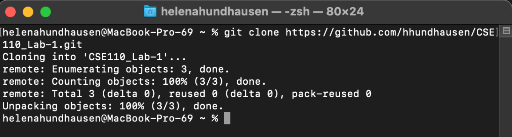
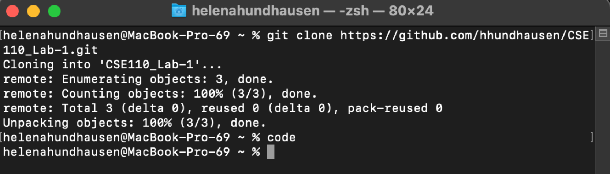
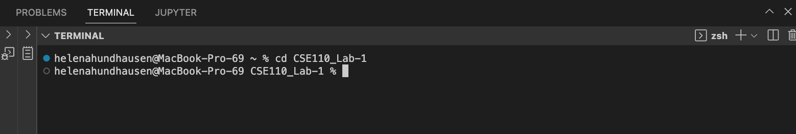
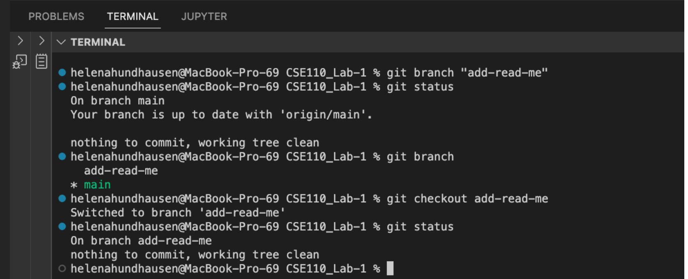
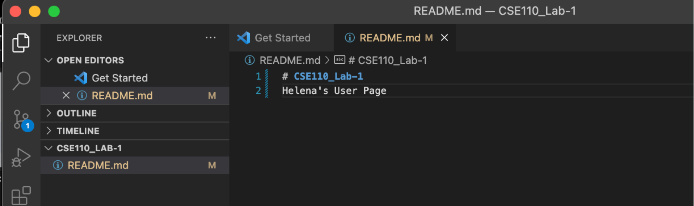
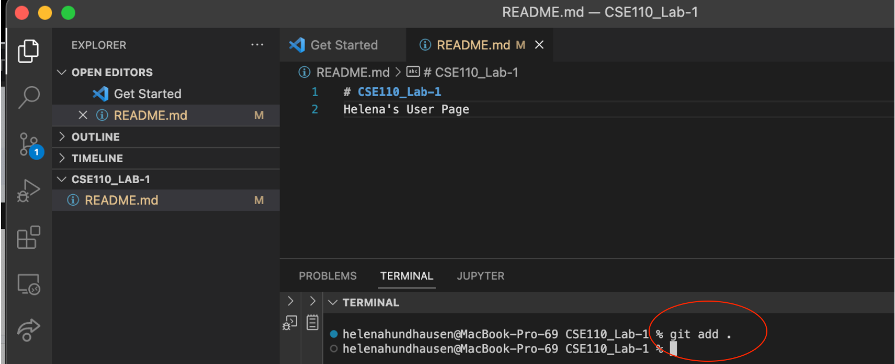
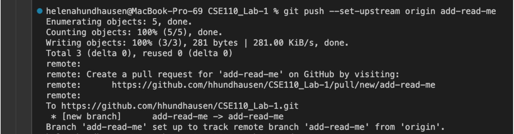

1. **clone** repository onto local machine using the command line 

2. **cd** into repository folder, create new git **branch** titled "add-read-me", and *checkou that branch in local repository 

3. Add text "<Your name>'s User Page" to the "README.md" file 
 

4. **add** the new file to git 
 

5. **commit** the files with the commit message "Update readme file"
 

6. **push** the commit to the remote brnach
  